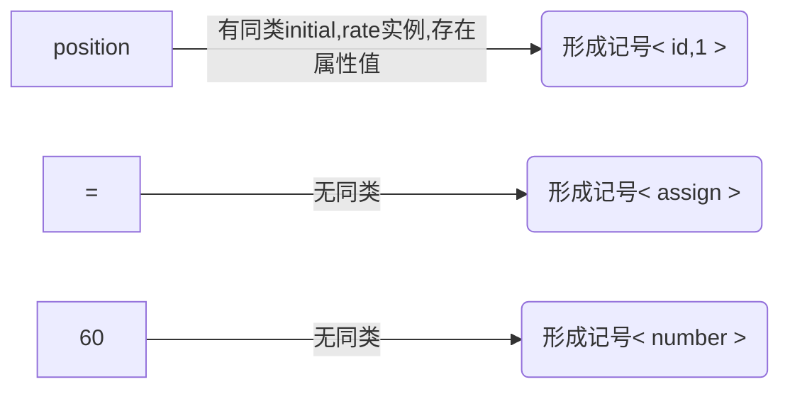

# 课前须知
> 评分与密码学大同小异，作业和点名不计入总分，但是作为调分的依据，作业分计入标准（是否准时，是否抄袭）。
> 课程难度:前难后稍难，不建议自学和考前突击。
> 期末闭卷，主要为概念理解和掌握方法
> 学期总评:期末80，实验20

- - -
# 第一章:引论
## 1.1 编译器概述
> 以下为编译的各个阶段
### 1.1.1 词法分析
[详见第二章](#第二章 词法分析)
> 又称线性分析或扫描
> 字符流是指源程序的编程语句，类似 `position=initial+rate*60`

> 注:记号流格式:`<记号名，属性名>`，记号名是同类词法单元共用名称，属性值为区分其他同类词法单元实例的特征值，若某类词法单元只有一个实例，则属性值可省略。例如

最终字符流转化为记号流 `<id，1><=><id，2><+><id，3><*><60>`（为直观某些部分改写）

### 1.1.2 语法分析
### 1.1.3 语义分析
### 1.1.4 中间代码生成
### 1.1.5 代码优化
### 1.1.6 代码生成
### 1.1.7 符号表管理
### 1.1.8 阶段的分组
### 1.1.9 解释器
## 1.2 编译器技术的应用（只做了解，不做考察）

- - -
# 第二章 词法分析
## 词法记号与属性
###
