# 课前须知
> 评分与密码学大同小异，作业和点名不计入总分，但是作为调分的依据，作业分计入标准（是否准时，是否抄袭）。
> 
> 课程难度:前难后稍难，不建议自学和考前突击。
> 
> 期末闭卷，主要为概念理解和掌握方法。
> 
> 学期总评:期末80，实验20
> >  $S=A^{1−(1−γ)B}×80+C×20$
> >
> > S 期末综合成绩
> > 
> > A 卷面成绩，归一化
> > 
> > B 作业&点名成绩，归一化（B=1，指数为γ，B=0，指数为1）
> > 
> > C 实验成绩，归一化
> > 
> > γ 难度调整因子（0.5~1）

# 第一章:引论
## 1.1 编译器概述
> 以下为编译的各个阶段

### 1.1.1 词法分析
<a href="#/?id=second">详见第二章</a>

> 又称线性分析或扫描
> 
> 字符流是指源程序的编程语句，类似 `position=initial+rate*60`
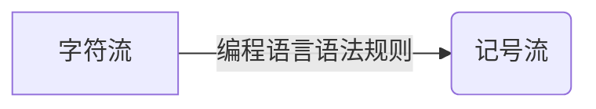
> 注:记号流格式:`<记号名，属性名>`，记号名是同类词法单元共用名称，属性值为区分其他同类词法单元实例的特征值，若某类词法单元只有一个实例，则属性值可省略。例如
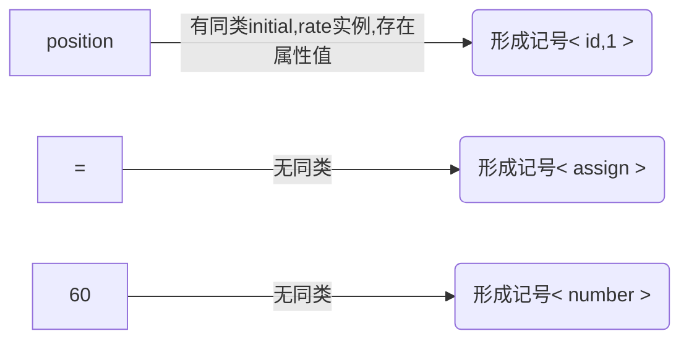
最终字符流转化为记号流 `<id，1><=><id，2><+><id，3><*><60>`（为直观某些部分改写）

### 1.1.2 语法分析
[详见第三章]()

#### 关于表达式
> 表达式的语法特征（形式化定义）
> > 任何一个标识符都是表达式
> >
> > 任何一个数都是表达式
> >
> > 如果 $e_1$ 和 $e_2$ 都是表达式，那么 $e_1$ + $e_2$ , $e_1$ * $e_2$ , $(e_1)$ 也都是表达式

<p align="center">
	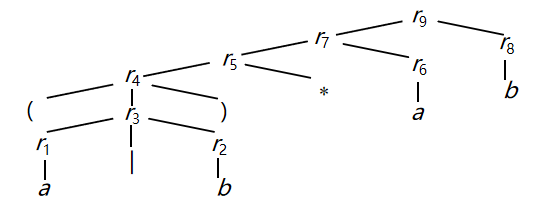
        <p align="center">
          <span>initial + rate * 60的分析树<span>
        </p>
</p>

#### 关于语法分析
> **语法分析** 简称 ***分析*** ，它检查词法分析输出的记号流是否符合编程语言的语法规则，并依据这些规则所体现出的语言 ***构造*** (construct，如函数、语句、表达式等)的层次性，用各记号的第一元简称一种树形的中间表示，这个中间表示用抽象语法方式描绘了该记号流的语法情况。一种是典型的中间表示是 **语法树** ，其中内部结点表示运算啊，它们的子结点代表该运算的运算对算。下面就是上面记号流 `<id，1><=><id，2><+><id，3><*><60>` 建立的语法树的过程。

<p align="center">
	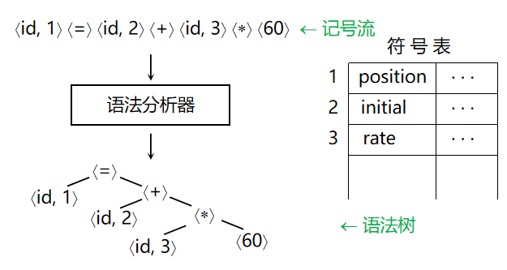
        <p align="center">
          <span>initial + rate * 60的语法树<span>
        </p>
</p>

> 理解: ***语法树就相当于告诉编译器当前的语句是什么*** 。

### 1.1.3 语义分析
[详见第四、五章]()

> ***语义分析*** 阶段使用语法树和符号表中的信息，依据语言定义来检查源程序各部分之间的语义一致性，以保证程序各部分能有意义地结合在一起。它还收集类型信息，把它们保存在符号表或语法树中。
> 
> 语义分析的一个重要部分是 ***类型检查*** ，编译器检查每个算符的运算对象，看它们的类型是否适当。例如，当实数(小数或分数)作为数组的下标时，许多语言的定义都要求编译器报告错误。语言定义也可能允许运算对象的类型作隐式转换，例如当二元算术算符作用于一个整数和一个实数时，编译器会把其中的整数转换为实数。
> 
> 例如：在机器内部， **整数的二进制表示和实数的二进制表示是有区别的，不论它们是否有相同的值** 。在  `position=initial+rate*60` 中，所有的变量都是实型，另外，由60本身可知它是整数。对其对应语法树进行类型检查会发现\*作用于实型变量 rate 和整数60，可以建立一个额外的算符结点inttofloat，它显式地把整数转变为实数。如下图所示。

<p align="center">
	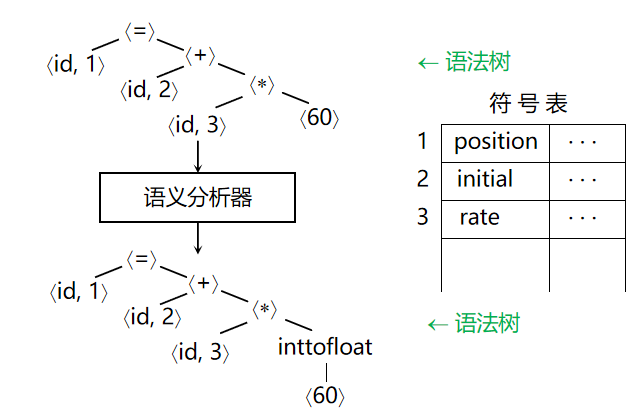
        <p align="center">
          <span>initial + rate * 60的语义分析<span>
        </p>
</p>

> 理解： ***语义分析就相当于告诉编译器当前的语句要干什么*** 。

### 1.1.4 中间代码生成
[详见第七章]()

> 经过语法分析和语义分析后，许多编译器为源程序产生更低级的显式中间表示，可以把这种中间表示想象成一种抽象机的程序。这种中间表示必须具有两个性质： ***它易于产生并且易于翻译成目标程序。***
> 
> 中间代码生成主要采用一种称为 ***三地址代码*** 的中间表示形式，它像一种抽象机器的汇编语言，这种机器中存储单元的作用类似于寄存器。三地址代码由三地址指令序列组成，每条三地址指令最多有三个操作数，语句 `position=initial+rate*60` 由中间代码生成器的三地址代码如下：
```ASM
tl=inttofloat(60)
t2=id3*t1
t3=id2+t2
idl=t3
```
> 这种中间形式有它的特点。首先，除了赋值算符外，每条指令至多还有一个算符，因此，在生成这些指令时，编译器必须决定运算完成的次序，语句 `position=initial+rate*60` 的乘优先于加。其次，编译器必须产生临时变量名，用以保留每条指令的计算结果。第三，某些三地址指令的运算对象不足三个，例如上述指令序列的第一条和最后一条指令。
> 
> 通常，除了计算表达式外，这些编译器采用的主要中间表示还要做其他事情，例如有条件控制转移、无条件控制转移和过程调用。

### 1.1.5 代码优化
[详见第九、十章]()

> 独立于机器的代码优化阶段试图改进中间代码，以便产生较好的目标代码。通常，“较好”是指执行较快，但也可能期望其他目标，如目标代码较短或目标代码执行时能耗较低。
>
> 如果中间代码生成算法比较简单，那么它就给代码优化留下了很多机会。例如，一个比较自然的中间代码生成算法，为语法树上的每个算符产生一条指令，因而得到上面这样的中间代码。
```ASM
tl=inttofloat(60)
t2=id3*t1
t3=id2+t2
idl=t3
```
> 用这样的中间代码生成算法再跟进一个代码优化阶段是一种可行的办法，因为产生较优代码问题可以在代码优化阶段得以解决。比如，代码优化器会推断出，把60从整数转变为浮点数可以在编译时完成，从而用60.0代替60就可以把inttofloat运算删去。还有，t3只被引用一次。就是取它的值传给id1，因此用id1代替t3,把上述的最后一条指令删除也是可以的。这样，经过代码优化器可以得到如下结果：
```ASM
tl=id3*60.0
id1 =id2+t1
```
> 不同的编译器所实现的优化程度是不同的，能完成大部分优化的编译器称为“优化编译器”，但这时编译时间中相当可观的一部分都消耗在这种优化上。简单的优化也可以使目标程序的运行时间大大缩短，而编译速度并没有降低太多。

### 1.1.6 代码生成
[详见第八章]()

> 代码生成是指取源程序的一种中间表示作为输入并把它映射到一种目标语言。如果目标语言是机器代码，则需要为源程序所用的变量选择寄存器或内存单元，然后把中间指令序列翻译为完成同样任务的机器指令序列。此阶段的一个关键问题是寄存器分配。
>
> 例如，使用寄存器R1和R2,上面的中间代码可以翻译成：
```ASM
MOVF id3,R2
MULF #60.0,R2
MOVF id2, R1
ADDF R2, R1
MOVF R1, idl
```
> 每条指令的第一个和第二个操作数分别代表源和目的操作数，每条指令的“F”告知指令处理浮点数。上述的代码把地址id3 的内容取入寄存器 R2（在此认为指令中id3代表对象id3的地址),然后把它乘上实数60.0,#号代表60.0作为立即数处理。第三条指令把id2取入寄存器R1,第四条指令再把寄存器 R2的值加上去，最后一条指令把寄存器R1 的值存人地址 id1。这样，该段代码实现了语句 `position=initial+rate*60` 的赋值。

### 1.1.7 符号表管理
[详见第七章]()

> 编译器的一项重要工作是记录源程序中使用的变量名字，并收集每个名字的各种属性。这些属性提供该名字有关存储分配、类型和作用域等信息。如果是过程名字，还有参数的个数、每个参数的类型、参数传递方式和返回值类型等。
> 符号表是为每个变量名字保存一个记录的数据结构，记录的域是该名字的属性。该数据结构应该设计成允许编译器迅速地找到一个名字的记录，并在此记录中迅速地存储和读取数据。
> 语句 `position=initial+rate*60` 的编译过程总结在下图中。

<p align="center">
	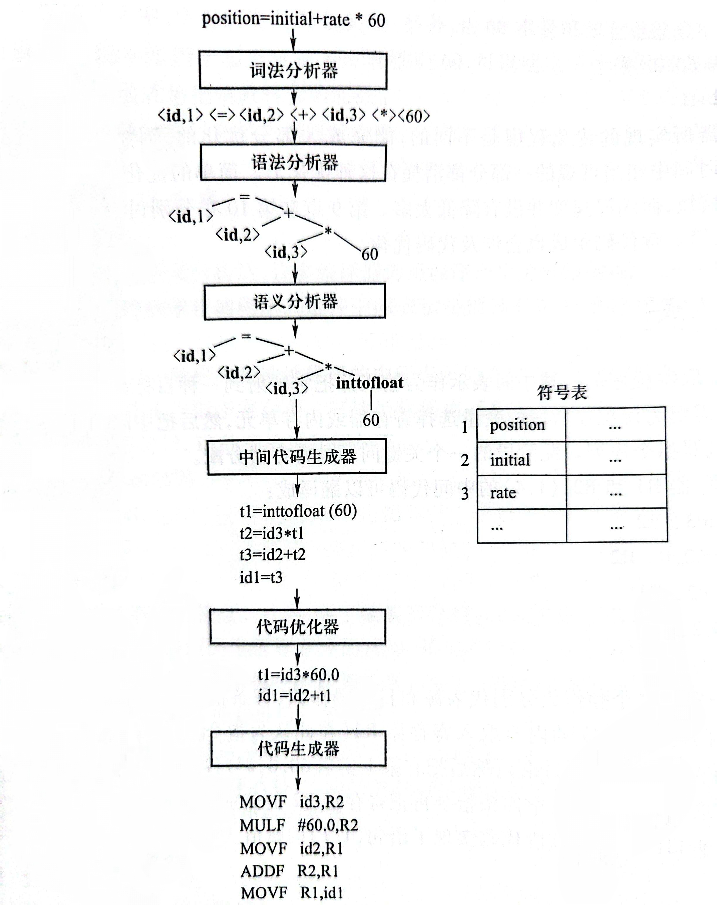
        <p align="center">
          <span>编译过程<span>
        </p>
</p>

### 1.1.8 阶段的分组
- [ ] 上面的介绍把编译器从逻辑上分成了7个阶段。最粗略的看法是把编译器分成分析和综合两大部分。分析部分揭示源程序的基本元素和它们所形成的层次结构，决定它们的含义，建立起源程序的中间表示，分析部分经常被称为前端。综合部分根据源程序的中间表示建立起和源程序等价的目标程序，它经常被称为 **后端** 。
- [ ] 在实际的编译器中，源于几个阶段的活动可以组合在一起，各阶段之间的中间表示也无须显式构造。源于几个阶段的活动常用一 ***遍(pass)*** 扫描来实现，一遍扫描包括读一个输入文件和写一个输出文件。例如，前端的词法分析、语法分析、语义分析和中间代码生成可以组成一遍，独立于机器的代码优化可以单独作为可选择的一遍，然后为特定目标机器的代码生成可以作为一个后端遍。
- [ ] 取一个编译器前端，重写它的后端以产生同一源语言在另一种机器上的编译器已经是件普通的事情。如果原先的后端是经过仔细设计的，那么往往不需要对它做很多的重新设计。
- [ ] 把几种不同的语言编译成同一种中间表示，让不同的前端使用同一个后端，从而得到一种机器上不同源语言的编译器，也已经有不少成功的例子。

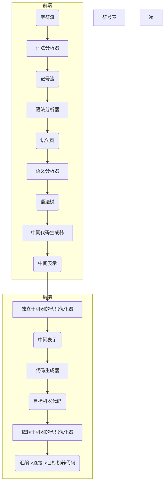
> 虎书对 ***编译器后端*** 的划分
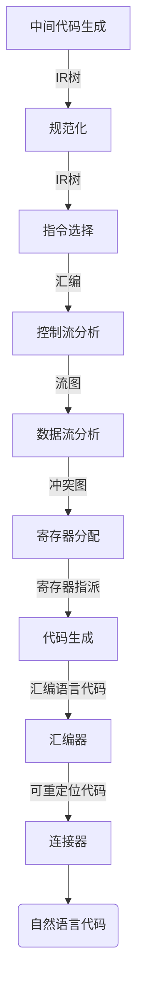

### 1.1.9 解释器
- [ ] 解释器是不同于编译器的另一类语言处理器。解释器不像编译器那样通过翻译来生成目标程序，而是直接执行源程序所指定的运算。解释器也有和编译器类似的地方，它也需要对源程序进行词法分析、语法分析和语义分析等，这样它才有可能知道源程序指定了一些什么运算。
- [ ] 解释执行的效率比编译器生成的机器代码的执行效率低。对于编译方式来说，对源程序的词法分析、语法分析和语义分析只要进行一次。而对于解释执行来说，每次执行到源程序的某个语句，都要对它进行一次词法分析、语法分析和语义分析，确定了这个语句的含义后，才能执行它指定的运算。显然，反复分析循环体降低了解释执行的效率，所以解释执行要寻找一种适合于解释的中间语言，以缩短反复分析源程序需要的时间。
- [ ] 在20世纪80年代的BASIC语言阶段解释器的功能
	- [x] 它将高级语言的源程序翻译成一种中间语言程序，然后对中间语言程序进行解释执行。
 	- [x] 在那个年代，解释器的两个功能（编译和解释）是合在一个程序中的，因此这个程序被统称为解释器。
- [ ] 进人Java语言年代解释器
	- [x] 的上述两个功能分离在两个程序中
 	- [x] 前一个程序称编译器，它把Java语言的程序翻译成一种中间语言程序，这种中间语言叫做字节码
  - [x] 后一个程序称解释器，它对字节码程序进行解释执行。

## 1.2 编译器技术的应用（只做了解，不做考察）
### 1.2.1 高级语言的实现
- 高级编程语言易于编程，但程序运行较慢
- 低级语言编程时可实施更有效的控制方式，得到更有效的代码，但难编写、易出错、难维护
- 流行编程语言的大多数演变都是朝着提高抽象级别的方向
- 每一轮编程语言新特征的出现都刺激编译器优化的新研究
  > 支持用户定义的聚合数据类型和高级控制流，如数组和记录、循环和过程调用：C、Fortran
  > 面向对象的主要概念是数据抽象和性质继承，使得程序更加模块化并易于维护：Smalltalk、C++、C#、Java
  > 类型安全的语言：Java没有指针，也不允许指针算术。它用无用单元收集机制来自动地释放那些不再使用的变量占据的内存
  > Java设计来支持代码移植和代码移动
### 1.2.2 与计算机体系结构的相互促进

<p align="center">
	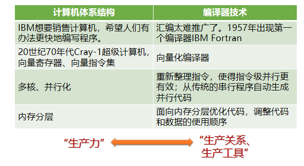
        <p align="center">
          <span>与计算机体系结构的相互促进<span>
        </p>
</p>
						
### 1.2.3 新计算机体系结构的设计
- [ ] 现在计算机系统的性能不仅仅取决于它的原始速度，还取决于编译器是否能生成充分利用其特征的代码
- [ ] 在现代计算机体系结构的研究中，在处理器的设计阶段就开发编译器，并将编译生成的代码在模拟器上运行，以评价拟采用体系结构的特征
- [ ] 编译器技术影响计算机体系结构设计的一个著名例子是精简指令集计算机（RISC）的发明
### 1.2.4 程序翻译
- 二进制翻译
	> 编译器技术可用于把一种机器的二进制代码翻译成另一种机器的代码，以运行原先为别的指令集编译的代码
- 数据库查询解释器
	> 数据库查询由一些谓词组成，这些谓词由包含关系运算的布尔表达式组成，可以被解释执行，也可以被编译成搜索数据库的命令
### 1.2.5 提高软件开发效率的工具
- 源于编译器中代码优化技术的程序分析一直在改进软件开发效率
	- [x] 类型检查
		> 类型检查是一种捕捉程序中前后不一致的成熟而有效的技术
	- [x] 边界检查
		> 数据流分析技术可用来定位缓冲区溢出
  - [x] 内存管理
		> 自动的内存管理删除内存泄漏等内存管理错误


# 第二章 词法分析
<span id="second"></span>

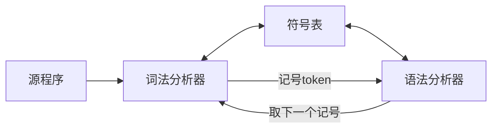

- 词法分析器：把构成源程序的字符流翻译成记号流，还完成和用户接口的一些任务
  > 如： `position = initial + rate * 60 → <id，1><=><id，2><+><id，3><*><60>`
  > 1. 剥去源程序的注解和（由空格、制表或换行符等引起的）空白；
  > 2. 把来自编译器各个阶段的错误信息和源程序联系起来；
  > 3. 如果源语言支持宏定义，那么对它们的预处理也可以在词法分析器完成。
- 记号：具有独立含义的最小词法单位
- 围绕词法分析器的自动生成展开
- 介绍正规式、状态转换图和有限自动机概念

## 2.1 词法记号与属性
### 2.1.1 词法记号、模式、词法单元
#### 定义
- 词法记号（简称记号）：是由记号名和属性值构成的二元组，*属性值不是必须项*。记号名为语法分析的输入符号。
  > *记号名是代表一类词法单元的抽象名字，比如标识符 <sup id="back1"><a href="#/?id=footnote1">1✍</a></sup> relation（关系，如<,>...，统称为relation）和某个特定的关键字如if（就是代表if判断）*
  > 
  > **粗俗理解就是关键词是某个编程语言中的语法词或者内置函数名，标识符为符合某种规则的变量或者函数名称**

- 模式：一个记号的模式描述属于该记号的词法单元形式。 ***在一个关键字作为一个记号的情况下，它的模式就是构成该关键字的字符序列。如if为模式为i,f***
  > 对于标识符和其他一些记号，他们的模式有更复杂的结构并且有很多字符串可以 **匹配** 它们，比如relation中的模式有<,>...。
  > ***为便于理解，不妨认为模式就是一个匹配规则，也就是当某个实例匹配到一个匹配规则时，也就是匹配到了一个记号名的模式***
  > > ***举个例子（C语言中）：printf("Total=%d\n",score);该语句中printf和score是匹配到id模式（可见下表即由字母开头的字母数字串）的词法单元，而"Total=%d\n"是匹配到litera模式(引号 " 和 " 之间任意不含引号本身的字符串)的词法单元***
- 词法单元（又称单词）：是源程序中匹配一个记号模式的字符序列，由词法分析器识别为该记号的一个实例。

<div align="center">
  <h6><strong>记号的例子</strong></h6>
  <table>
  <thead>
    <tr>
      <th>记号名</th>
      <th>词法单元例举</th>
      <th>模式的非形式描述</th>
    </tr>
  </thead>
  <tbody>
    <tr>
      <td>if</td>
      <td>if</td>
      <td>字符i, f</td>
    </tr>
    <tr>
      <td>for</td>
      <td>for</td>
      <td>字符f, o, r</td>
    </tr>
    <tr>
      <td>relation</td>
      <td>&lt;, &le;, =, …</td>
      <td>&lt; 或 &le; 或 = 或 …</td>
    </tr>
    <tr>
      <td>id</td>
      <td>sum, count, D5</td>
      <td>由字母开头的字母数字串</td>
    </tr>
    <tr>
      <td>number</td>
      <td>3.1, 10, 2.8E12</td>
      <td>任何数值常数</td>
    </tr>
    <tr>
      <td>literal</td>
      <td>"seg. error"</td>
      <td>引号 " 和 " 之间任意不含引号本身的字符串</td>
    </tr>
  </tbody>
</table>
</div>

#### 历史上词法定义中的一些问题
- 忽略空格（空格无意义，除非在字符串中，不作为语法单元的分隔符）带来的困难
	> DO 8 I = 3. 75 等同于 DO8I=3. 75 ，只有看到小数点，才知道DO不是关键字，而DO8I为一个关键字.
 
	> DO 8 I = 3, 75有7个记号，只有看到逗号才知道DO是关键字，8为语句标号，I为标识符。
- 关键字不保留
	> IF THEN THEN THEN=ELSE；ELSE …

- 关键字、保留字和标准标识符的区别
  > 保留字是语言预先确定了含义的词法单元。
  > > ***便于理解，相当于没有功能的关键词，还是不能当普通标识符使用。***
  
  > 标准标识符也是预先确定了含义的标识符，但程序可以重新声明它的含义。

### 2.1.2 词法记号的属性
> 为了区分同一个记号中的不同单词，比如记号relation中的单词<,>...所以需要给记号以属性，用属性来记住记号的附加信息，以便需要时使用。
> ***通俗来讲，记号名影响语法分析的决策，属性影响记号的翻译***

- 例如：position = initial + rate * 60的记号和属性值：
	- [x] <id，指向符号表中position条目的指针>
	- [x] < assign_op >(此处没有属性值，是因为记号名已经足以判断词法单元)
	- [x] <id，指向符号表中initial条目的指针>
	- [x] < add_op >
	- [x] <id，指向符号表中rate条目的指针>
	- [x] < mul_op >
	- [x] <number，整数值60>

### 2.1.3 词法错误
#### 定义
- 词法分析器对源程序采取非常局部的观点
  > - [x] 例：难以发现下面的错误
  > > fi (a == f (x) ) 
- 在实数是“数字串.数字串”格式下，可以发现下面的错误
	> 123.x
- 紧急方式的错误恢复
	> 删掉当前若干个字符，直至能读出正确的记号
- 错误修补（基于这样的假设，大多数词法错误是多、漏或错了一个字符或者相邻的两个字符错位。但是这种假设通常是（但不总是）正确的）
	> 进行增、删、替换和交换字符的尝试

#### 示例
```
下面C语言编译器编译下面的函数时，报告
	parse error before 'else'
long gcd(p,q)
long p,q;
{
	if (p%q == 0)
		/* then part */
		return q		此处遗漏分号
	else
		/* else part */
		return gcd(q, p%q);
```
此时会尝试删除一部分，比如删去当前位置前方的 `*/` ，
```
现在少了第一个注释的结束符号后，反而不报错了
long gcd(p,q)
long p,q;
{
	if (p%q == 0)
		/* then part 
		return q
	else
		/* else part */
		return gcd(q, p%q);
}
```
这个说明自我改错，不一定是正确的。

## 2.2 词法记号的描述与识别
### 2.2.1 串和语言
#### 定义
- **字母表** : ***表示符号的有限集合*** ，符号的典型例子由英文字母和标点符号。集合{0,1}是二进制字母表；ASCII是字母表的重要例子，；Unicode是另一个重要例子，包含了全世界各个字母表的大约十万个字符。
- **串** ： ***字母表符号的有穷序列为该字母表上的串*** 。 *串s的长度是出现在s中符号的个数，往往写为|s|* 。
	> **空串是长度为0的特殊串，用 $\epsilon$ 表示**
- **语言** ： ***表示字母表上的一个串集*** 。
- **句子** ： ***属于某个语言的串成为该语言的句子或者字*** 。
	> **空集 $\varnothing$ 和{ $\epsilon$ }(仅含空串 $\epsilon$ )也符合上述的定义**

#### 串的运算
- **连接** : **x,y都为串，则x和y的连接写为xy，即把y加到x后面形成的串** 。
	> **对于连接运算，空串是个恒等元素，即 $s\epsilon =\epsilon s =s$**
- **幂** : **s为串，定义 $s^0$ 为 $\epsilon$ , $s^i$ 为 $s^{i-1}s(i>0)$** 。
	> **由于 $\epsilon s =s$ 所以 $s^2=ss,s^3=sss$ ，即幂就是n次连接的意思。** 
-  **选择** : **x,y都为串，则x和y的选择写为x|y，即在x和y中进行选择x或y形成的串(串的选择运算非常不常用，在正规式里面理解为并集运算，在正规定义中理解为多选一的选择就可以)** 。

#### 语言的运算
- **幂** : **L为语言，定义 $L^0$ 为{ $\epsilon$ }, $L^i$ 为 $L^{i-1}L(i>0)$ ,即 $L^i$ 是L连接它自己i-1次** 。
- **并** : **L，M为语言，定义 $L \cup M=\lbrace s|s属L或s属M\rbrace$ ，L和M的并写为 $L \cup M$** 。
- **连接** : **L，M为语言，定义 $LM=\lbrace st|s属L且t属M\rbrace$ ，L和M的连接写为 $LM$** 。
- **闭包** : **L为语言，定义 $L^*= \bigcup\limits_{i=0}^\infty L^i,L^{\*}表示0个或者多个L连接的并集$ ，L的闭包写为 $L^{\*}$** 。
- **正闭包** : **L为语言，定义 $L^+= \bigcup\limits_{i=1}^\infty L^i,L^{+}表示1个或者多个L连接的并集$ ，L的闭包写为 $L^{+}$** 。
> - [x] 示例：L:{ A, B, …, Z, a, b, …, z }, D: { 0, 1, …, 9 }
> - [x] $L \cup M$ 字母和数字的集合。
> - [x] $LD$ 所有由一个字母后跟随一个数字组成的串的集合。
> - [x] $L^6$ 所有由6个字母组成的串的集合。
> - [x] $L^*$ 所有字母串(包括 $\epsilon$ )的集合。
> - [x] $L(L \cup M)^*$ 以字母开头的所有字母数字串的集合。
> - [x] $D^+$ 不含空串的数字串的集合。

### 2.2.2 正规式
#### 定义
- ***正规式(又称正规表达式，正则表达式 <sup id="back2"><a href="#/?id=footnote2">2✍</a></sup>)*** : **按照一组定义规则，由较简单的正规式构成的，每个正规式r表示一个语言L(r)**
	> 通俗理解，正规式就是一套规则定义，里面的实例为满足该规则的词法单元。
- **以下是字母表 $\sum$ 上正规式的规则，和每条规则相联系的是被定义的正规式所表示的语言的描述：**
	> 1. $\epsilon$ 是正规式，它表示{ $\epsilon$ }
	> 2. 如果a是 $\sum$ 上的符号，那么a可以作为正规式，他表示语言{a}。虽然都用a表示，但是正规式a是不同于{a}中的句子a的，从上下文可以清楚地区别所谈到的a是正规式还是串。
	> 3. 假定r和s都是正规式，它们分别表示语言L(r)和L(s)，那么(r)|(s)、(r)(s)、 $(r)^{\*}$ 和(r)都是正规式，分别表示语言 $L(r) \cup L(s)$ 、 $L(r)L(s)$ 、 $(L(r))^*$ 和 $L(r)$ 。
- ***正规式表示的语言叫做正规语言或者正规集***
  > - [ ] 如果有约定:
  > - [x] 1.闭包运算(算符为*)有最高的优先级并且是左结合的运算；
  > - [x] 2.连接运算(两个正规式并列)的优先级次之且也是左结合的运算；
  > - [x] 3.选择运算(算符是|)的优先级最低且仍然是左结合的运算。
  > - [x] 那么可以避免正规式中一些不必要的括号。例如， $((a)(b)^{\*})|(c)$ 等价于 $ab^{\*}|c$

| 正规式                    | 定义的语言              | 备注                           |
| ------------------------- | ----------------------- | ------------------------------ |
| $\epsilon$                | { $\epsilon$ }          |                                |
| $a$                       | { $a$ }                 | $a \in\sum$                    |
| $(r) \| (s)$              | $L(r) \cup L(s)$        | r和s是正规式                    |
| $(r)(s)$                  | $L(r)L(s)$              | r和s是正规式                    |
| $(r)^{\*}$                | $(L(r))^{\*}$           | r是正规式                       |
| $(r)$                     | $L(r)$                  | r是正规式                       |
| $((a)(b))^{\*}\|(c)$      |可以写成 $ab^{\*}\|c$    |                                 |  

#### 示例
> 正规式的例子 $\sum = \lbrace a, b\rbrace$
> > $a|b$ 代表集合 $\lbrace a, b\rbrace$ (语言也是一种集串所以也可以说这个集合代表了一种语言，下同)
> > 
> > $(a|b)(a|b)$ 代表集合 $\lbrace aa, ab, ba, bb\rbrace$
> > 
> > $aa|ab|ba|bb$ 代表集合 $\lbrace aa, ab, ba, bb\rbrace$
> > 
> > $a^*$ 表示由字母a构成的所有串集，包括空串
> > 
> > $(a|b)^{\*}$ 由a和b构成的所有串集，包括空串

> 复杂的例子
> > $(00|11|((01|10)(00|11)^{\*}(01|10)))^{\*}$
> > 
> > 句子：01001101000010000010111001
> > 
> > 描述：0和1的个数都是偶数的01串

#### 正规式的代数定理

| 定律                    | 描述              | 
| :----------------------: | :-----------------------: |
| $r\|s=s\|r$               | $\|$ 是可交换的         |
| $r\|(s\|t)=(r\|s)\|t$     | $\|$ 是可交换的         |
| $(rs)t=r(st)$             | 连接是可结合的           |
| $r(s\|t)=rs\|rt;(s\|t)r=sr\|tr$  | 连接对 $\|$ 是可分配的    |
| $\epsilon r=r;r\epsilon =r$  | $\epsilon$ 是连接的恒等元素    |
| $r^{\*}=(r\|\epsilon)^{\*}$  | $\epsilon$ 肯定出现在一个闭包中|
| $r^{\*\*}=r^{\*}$      | *是幂等的    |

### 2.2.3 正规定义
#### 定义
- ***正规定义*** : ***为了在引用相应正规式时在表示时更加简洁，对正规式进行命名*** 。
- 例：如果 $\sum$ 是基本符号的字母表，那么 **正规定义** 是形式为 $d_1 → r_1  \ d_2 → r_2...d_n → r_n$ 的定义序列。
  > 各个 $d_i$ 的名字都不同；
  >
  > 每个 $r_i$ 都是 $\sum \cup \lbrace d_1,d_2,...,d_n\rbrace$上的正规式
  >
  > - [x] 满足上述两个条件后，每个 $r_i$ 都只能含有 $\sum$ 上的符号和前面定义的名字，因此不会出现递归定义的情况。这些名字用其所表示的正规式来代替，就可以为任何 $r_i$ 构造 $\sum$ 上的正规式。

#### 示例
- C语言的 **标识符** 是字母、数字和下划线组成的串 
	> $letter\underline{}→ A | B | … | Z | a | b | … | z |\underline{}$
 	> 
	> $digit→ 0 | 1 | … | 9$
 	> 
	> $id→letter\underline{}(letter\underline{}|digit)^*$

- 无符号数集合，例1946, 11.28, 63E8, 1.99E-6
	> $digit → 0| 1 | … | 9$ (0~9数字集合)
	> 
	> $digits → digit \ digit^*$ (整数集合,可以简写为 $digit^{\*}$ )
	>
 	> $optional\underline{}fraction → .digits|ε$ (可选的分数部分,即(.后连接一个数字)或者为空串，所以说是可选的，这里就体现了选择优先级小于连接)
	> 
	> $optional\underline{}exponent → ( E ( + | - | ε ) digits ) | ε$ (可选的指数部分,即(E后连接一个±或者空串在连接一个数字)或者空串，所以是可选的)
	>
	> $number \rightarrow digits \ optional\underline{}fraction \ optional\underline{}exponent$
 	> > 简化表示: $number → digit^+ (.digit^+)? (E(+|-)? digit^+)?$ (?在这里可以代表可以为?前的正规式或者为空串)
	
- 正规定义的例子（进行下一步<sup id="ExampleBack"><a href="#/?id=next1">➷</a></sup>讨论的例子）
	- [x] $while → while$
	- [x] $do → do$
	- [x] $relop → < | < = | = | < > | > | > =$
	- [x] $letter → A | B | … | Z | a | b | … | z$
	- [x] $id → letter (letter | digit )^*$
	- [x] $number → digit^+(.digit^+)? (E (+|-)? digit^+)?$
	- [x] $delim → blank | tab | newline$ (非终结符号，表示分隔符,后面分别代表空格、制表符和换行符)
	- [x] $ws → delim^+$ (通常表示空白字符（whitespace）)

#### 关于部分简写
- [x] ***?***:**零个或者一个实例。 $r?=r|\epsilon$ , $(r)?=L(r) \cup \lbrace \epsilon \rbrace$**
- [x] ***字符组***:**[abc](a、b和c是字母表的符号)表示正规式 $a|b|c$。缩写字符组[a-z]表示正规式 $a|b|...|z$ 。例如 $letter\underline{} → [A-Za-z]$ 。**

#### 例题(非常重要且很难，主要得掌握思想)
- 问题：写出语言“所有相邻数字都不相同的非空数字串”的正规定义
  > - [x] $no_{0-8} → 9$ (不含0-8并且满足相邻数字都不相同的非空数字串)
  > - [x] $no_{0-7}→ (8|no_{0-8} \ 8)(no_{0-8} \ 8)^*(no_{0-8}| \ espilon)|no_{0-8}$ (不含0-7并且满足相邻数字都不相同的非空数字串)
  > - [x] **来分析以下上面的定义结构,总体上看是两个大的选择，一个是9，一个是 $no_{0-7}→ (8|no_{0-8} \ 8)(no_{0-8} \ 8)^{\*}(no_{0-8}| \ espilon)$ ，而这一串可以看出来要么开头是8，要么是98(可以不为9是因为之前有一个单独为9的选择)，然后中间就是接多个98串或者不接，最后结尾就相当于是在选择以9结尾还是不选择(即以8结尾)。** 
  > - [x] ...(重复上面定义就可以)
  > - [x] $no_{0} → (1|no_{0-1} \ 1) (no_{0-1} \ 1 )^*(no_{0-1}| \epsilon) | no_{0-1}$ (不含0并且满足相邻数字都不相同的非空数字串)
  > - [x] $answer → (0|\epsilon ) (no_{0} \ 0 )^* (no_{0} | \epsilon )|no_{0}$ 包含空串，不符合定义
  > - [x] $answer → (0 |no_{0} \ 0 ) (no{0} \ 0 )^* (no_{0}  | \epsilon)|no_{0}$
  > - [x] ***总结，发现此类问题类似一个递归的过程，可以从简入繁。而且需要会用已知的某些正规式去推其他的正规定义，比如上面的代表偶数个1和0的0，1串定义为even10，则偶数个0奇数个1可以定义为even10 1 even10***

#### 二义性及其消除
- ***如何理解do8？***
  > - [ ] 关键词do和整数8? 
  > - [ ] 标识符（id）do8?
- ***解决方法：***
  > - [x] ***最长匹配：取可与任何(任意)正规表达式匹配的最长的字符串作为一个记号***
  > - [x] ***规则优先：对于特定的初始子串，第一个与之匹配的正则表达式决定了这个子串的记号类型。此时正规定义的顺序是有意义的***
  > - [x] ***最长匹配下，do8被解释为一个标识符；规则优先下，do是一个关键字***

### 2.2.4 状态转换图
#### 定义
- 在上述的正规定义的例子<sup id="next1"><a href="#/?id=ExampleBack">➹</a></sup>中，可以看到，在词法单元中还有间隔符ws，词法分析器通过把剩余输入的前缀(即一个语法单元前面多余的部分)和ws相比较来完成忽略的词法单元之间的空白。
- 如果剩余输入的前缀<sup id="back3"><a href="#/?id=footnote3">3✍</a></sup>可以由ws匹配，词法分析器不返回记号给分析器，继续寻找空白后面的记号，然后再返回到分析。一般的正规式是有对应记号的。但是正规式ws没有对应的记号，可见下表。

<div align="center">
	<table>
  <tr>
    <th>正规式</th>
    <th>记号名</th>
    <th>属性值</th>
  </tr>
  <tr>
    <td><strong>ws</strong></td>
    <td>-</td>
    <td>-</td>
  </tr>
  <tr>
    <td>while</td>
    <td><strong>while</strong></td>
    <td>-</td>
  </tr>
  <tr>
    <td>do</td>
    <td><strong>do</strong></td>
    <td>-</td>
  </tr>
  <tr>
    <td><strong>id</strong></td>
    <td><strong>id</strong></td>
    <td>符号表条目的指针</td>
  </tr>
  <tr>
    <td><strong>number</strong></td>
    <td><strong>number</strong></td>
    <td>数表条目的指针</td>
  </tr>
  <tr>
    <td>while</td>
    <td><strong>while</strong></td>
    <td>LT(<)、LE(≤)、EQ(=)、NE(≠)、GT(>)或GE(≥)</td>
  </tr>
</table>
</div>

- *绘制 **状态转换图(简称转换图)** 是构造词法分析器的第一步* 。 ***状态转换图描绘词法分析器被语法分析器调用时，词法分析器未返回下一个记号所做的动作*** 。

#### 示例
- ***关系算符的转换图***

<p align="center">
	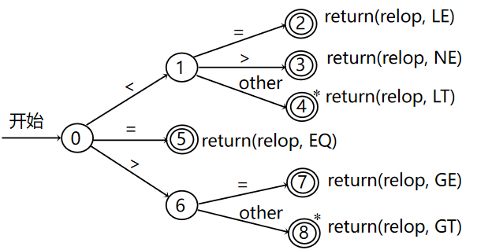
        <p align="center">
          <span>关系算符的转换图<span>
        </p>
</p>

- [x] 解释：转换图上的圆圈表示 **状态**，状态由有向 **边** 连接，边上有指示输入字符的标记，标记通常是一个字符。若离开形状s的某个边上(类似上图6到8处有个other)，则表示离开s的其他边所指示的字符以外的任意字符(以6到8的为例，6→8边上有一个other表示除6→7上的=的字符以外的任意字符)。
- [x] 本节讨论的转换图是确定的，即不可能出现某一字符和离开一个状态的两条边上的标记都匹配的情况。
- [x] 在转换图中有一个状态标记为开始状态，为转换图的初始状态。当开始识别记号时，控制进入开始状态。当控制进入某个状态时，读输入串的下一个字符，如果离开这个状态的一条边上的标记和该输入字符匹配，控制就进入由这条边指向的状态，否则识别过程失败。某些状态为圆环，表示为 **接收状态** ，控制进入这样的状态表明识别了一个记号。接收状态可以有动作，控制到达接收状态时执行它的动作。
> 例：对于上述的转换图，如果输入串是“<=...”那么控制从开始状态0达到接受状态2，读出语法单词<=，执行动作return(relop LE)。
> > ***注意，如果到达接受状态4，意味着<和另一个字符已被读过，由于这第二个字符不是关系算符<的一部分，因此必须把输入串上指示下一个字符的指针回退一个字符。用\*表示输入指针必须回退的状态。然后输出<。比如输入串是“<a..."，那么在读入<后从转态0变为1，然后读入a，发现与2，3中的标识符均不一样，所以就会进入状态4，执行return(relop LT)，并且指针退回到a前，以便后续识别。***

- ***标识符和关键字的转换图***

<p align="center">
	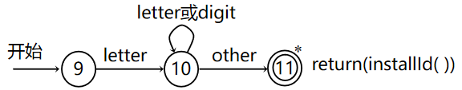
        <p align="center">
          <span>标识符和关键字的转换图<span>
        </p>
</p>

- [x] 上述是识别标识符的转换图，其中边上的标记 **letter** 和 **digit** 分别指字母集和数字集。边上的标记是一个字符集时，若输入字符是该字符集的成员，则称该标记和这个字符匹配。也可以用该转换图来识别关键字，因为关键字是特殊的标识符。当然，到达接受状态时，需要执行某段代码，以判定到达接受状态的词法单元是关键字还是标识符。
- [x] 把关键字从标识符中分离出来的简单办法是 *建立一张**关键字表** 。*  在扫描任何字符之前，把构成关键字的串，如 **while** 和 **do** 等都置入该表，把与它们对应的记号名也加入该表，以便识别出这些串时返回。上图中接受状态旁边的返回语句使用 *installd()* 来获取要返回的记号名和属性。过程 *installld()* 首先查看关键字表，如果当前词法单元构成关键字，则返回相应的记号；否则该词法单元是标识符。该过程再查标识符表，如果在表中发现该词法单元则返回相应的条目指针，如果没有找到，则把该词法单元填入标识符表，并返回新建条目的指针（很多编译器在语法分析阶段才将标识符填入标识符表，这时id的属性是它的拼写形式）。
- [x] 如果要识别的关键字有所变化，无须修改转换图，只需给关键字表重新置初值即可。为关键字单独构造转换图是可能的。对典型的编程语言来说，这么做会使词法分析器的状态数多达几百个。而用上面的方法，不到100个状态可能就够了。

- ***无符号数的转换图***

<p align="center">
	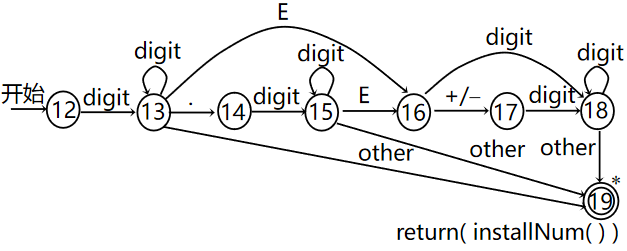
        <p align="center">
          <span>无符号数的转换图<span>
        </p>
</p>

- [x] 正规定义 $number → digit^{\*}(.digit^{\*})？(E(+ | -)? digit^{\*})?$ 为无符号数构造识别器。注意，这个定义中，小数部分 $（.digit^{\*}）$ 和指数部分 $（E（+1-）？digit^{\*}）$ 是可选的。上图是它的状态转换图。
- [x] 到达接受状态的动作是调用过 *installNum()* ，它把词法单元置入数表，并返回建立的条目指针。词法分析器返回记号名number 和作为属性值的这个指针。

- ***空白的转换图***

<p align="center">
	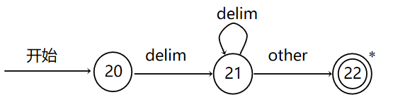
        <p align="center">
          <span>空白的转换图<span>
        </p>
</p>

- [x] $delim → blank | tab | newline$ 和 $ws → delim^+$ 为ws的正规定义。
- [x] 代表空白的ws的处理和上面讨论的代表各种记号的正规式的处理有所不同，因为在输入串中发现空白时，并没有任何东西返回给语法分析器。识别ws的转换图如上图所示。把这个转换图和其他几个转换图合并成一个转换图后，到达接受状态 22的动作就是回到开始状态，识别下一个记号。

- ***if + switch实现***

<p align="center">
	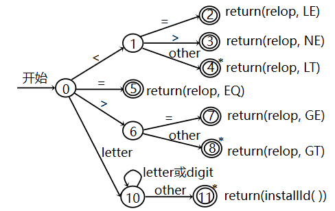
        <p align="center">
          <span>if + switch实现<span>
        </p>
</p>

- [x] 把上面前3个图的个开始状态0、9和12合并成一个开始状态，就可以把这三个转换图合并成一个转换图。从而可以实现很多功能，比如上述的if+switch的实现。
- [x] 一般这种转换图除了会有一个关键字表，标识表和数表以外还有一个转移矩阵，如下所示。
> 转移矩阵有以下规则:
> > 0表示不存在相关转移；
> > \*表示该状态下多读了一个字符；
> > 这里是把输入字符先进行分类，然后再进行转移；也有的实现，会在横坐标把所有字符都列出来。

<div align="center">
<table>
  <tr>
    <th></th>
    <th><</th>
    <th><=</th>
    <th>></th>
    <th>letter</th>
    <th>...</th>
  </tr>
  <tr>
    <td>0</td>
    <td>1</td>
    <td>5</td>
    <td>6</td>
    <td>10</td>
    <td>0</td>
  </tr>
  <tr>
    <td>1</td>
    <td>4*</td>
    <td>2</td>
    <td>3</td>
    <td>4*</td>
    <td>4*</td>
  </tr>
  <tr>
    <td>2</td>
    <td>0</td>
    <td>0</td>
    <td>0</td>
    <td>0</td>
    <td>0</td>
  </tr>
  <tr>
    <td>3</td>
    <td>0</td>
    <td>0</td>
    <td>0</td>
    <td>0</td>
    <td>0</td>
  </tr>
  <tr>
    <td>...</td>
    <td>...</td>
    <td>...</td>
    <td>...</td>
    <td>...</td>
    <td>...</td>
  </tr>
  <tr>
    <td>10</td>
    <td>11*</td>
    <td>11*</td>
    <td>11*</td>
    <td>10</td>
    <td>...</td>
  </tr>
  <tr>
    <td>11</td>
    <td>0</td>
    <td>0</td>
    <td>0</td>
    <td>0</td>
    <td>0</td>
  </tr>
</table>
</div>

## 2.3 有限自动机

- 语言的 ***识别器*** 是一个程序，它取串x作为输入，当x是语言的句子时，它回答“是”，否则回答“不是”。可以通过构造称为有限自动机的更一般的转换图，把正规式翻译成识别器。
- 有限自动机分成 ***确定*** 的和 ***不确定*** 的两种情况。“不确定”的含义是，存在这样的状态，对于某个输入符号，它 ***存在不止一种转换*** 。
- 确定的和不确定的有限自动机都正好能识别正规集，也就是它们能识别的语言正好是正规式所能表达的语言。但是，它们之间存在着时空权衡问题：从确定的有限自动机得到识别器，比从等价的不确定的有限自动机得到识别器要快得多；但是，确定的有限自动机可能比等价的不确定有限自动机占用更多的空间。由于把正规式变成不确定的自动机更直接一些，因此下面首先讨论这类自动机。
本节和下一节的基本例子是正规式 $(a|b)^{\*}ab$ 表示的语言。类似的语言在实际应用中也有，例如，表示所有以.0结尾的文件名的正规式是 $(.|o|c)^{\*}$ .0的形式，其中c代表除.和。以外的任何字符。另一个例子是，C语言的注释是以/\*开始和以\*/结束的任意字符串，但它的任何前缀（本身除外）不以*/结尾。

### 2.3.1 不确定的有限自动机(Non-deterministic Finite Automata简称NFA)
#### 定义
> 一个数学模型，包括：
1. 有限的状态集合S
2. 输入符号集合 $\sum$ (也称输入符号字母表，代表空串的 $\epsilon$ 绝对不出现在 $\sum$)
3. 转换函数 $move : S × (\sum \cup \lbrace \epsilon \rbrace)→P(S)，[P(S)是S的幂集]$ ,把状态和符号(可以是 $\epsilon$ )两元组映射到一个状态集合
4. 状态 $s_0$ 是唯一的开始状态
5. 状态集合F是接受(或终止)状态集合，并且 $F\subseteq S$ 是接受状态集合

> NFA 可以用带标记的有向图表示，即状态转换图，结点表示状态，有标记的边代表转换函数。这种转换图和上一节中的状态图略有区别，在这里，可以把同样的符号标记在出自同一个状态的多条边上。另外，边可以由输入符号标记，也可以由特殊符 $\epsilon$ 标记。

<p align="center">
	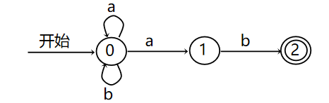
        <p align="center">
          <span>识别(a|b)*ab的NFA<span>
        </p>
</p>

- [x] 可以识别语言 $(a|b)^{\*}ab$ 的NFA的转换图如上图所示。这个NFA的状态集合是{0，1，2}，输入符号表是{a，b}，状态0是开始状态，接受状态2用双圈表示。
- [x] NFA可以用这种转换图来描述，在计算机上它可以用不同的方法实现。最简单的办法是转换表，每个状态一行，每个输人符号和 $\epsilon$ (如果需要的话)各占一列，表的第i行中对应符号a的条目是一个状态集合(说得更实际一些，是状态集合的指针)，表示NFA在输入是a时，状态i所能到达的状态集合。

<div align="center">
	<p align="center"><span>识别(a|b)*ab的NFA转换表</span></p>
	<table>
  <tr>
    <th style="text-align:center" rowspan="2">状态</th>
    <th style="text-align:center" colspan="2">输入符号</th>
  </tr>
  <tr>
    <td style="text-align:center">a</td>
    <td style="text-align:center">b</td>
  </tr>
  <tr>
    <td style="text-align:center">0</td>
    <td style="text-align:center">{0, 1}</td>
    <td style="text-align:center">{0}</td>
  </tr>
  <tr>
    <td style="text-align:center">1</td>
    <td style="text-align:center">Ø</td>
    <td style="text-align:center">{2}</td>
  </tr>
  <tr>
    <td style="text-align:center">2</td>
    <td style="text-align:center">Ø</td>
    <td style="text-align:center">Ø</td>
  </tr>
</table>
</div>

> 转换表的优点是可以快速访问给定状态和字符的状态集。它的缺点是，当输入字母表较大，并且大多数转换是空集时，占用了大量空间。显然，很容易把有限自动机的一种实现转变成另一种实现。
> - [x] NFA接受输入串x，当且仅当转换图中存在从开始状态到某个接受状态的路径，该路径各边上的标记可拼成x。上图中的NFA接受输入串ab，aab，bab,aaab，... 例如：从0状态开始，标记为a的边再到状态0，然后沿着标记分别为a和b的边先后到达状态1和2构成的路径，接受aab。对一个输入，可能有多条路径可以到达接受状态。
> - [x] 由NFA定义的语言是它接受的输入串集合，不难看出上面的NFA可识别(也称接受) $(a|b)^{\*}ab$ 。
#### 举例
下图是识别 $aa^{\*}bb^{\*}$ 的NFA,串aaa由通过0,1,2,2和2的路径来接受，相应边上的标记分别是 $\epsilon$ ，a，a和a，它们拼成aaa， $\epsilon$ 在拼接中“消失”。

<p align="center">
	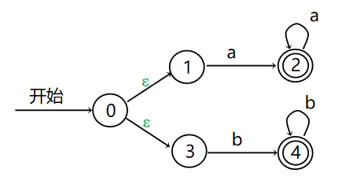
        <p align="center">
          <span>识别aa*bb*的NFA<span>
        </p>
</p>

### 2.3.2 确定的有限自动机(Deterministic Finite Automata,简称DFA)
#### 定义
> 一个数学模型，包括：
1. 有限的状态集合S,任何状态都没有 $\epsilon$ 转换，即任何状态必须进入输入符号的匹配才能进入下一个状态
2. 输入符号集合 $\sum$ (也称输入符号字母表，代表空串的 $\epsilon$ 绝对不出现在 $\sum$)
3. 转换函数 $move : S × \sum →S$ , ***且可以是部分函数*** ，对任何状态s和任何输入符号a,最多最多只有一条标记为a的边离开s。
4. 状态 $s_0$ 是唯一的开始状态
5. 状态集合F是接受(或终止)状态集合，并且 $F\subseteq S$ 是接受状态集合

- 确定的有限自动机从任何状态出发，对于任何输入符号，最多只有一个转换。如果用转换表来表示DFA的转换函数，那么表中的每个条目最多只有一个状态。结果是，很容易确定DFA是否接受一个输入串，因为从开始状态起，最多只有一条到达某个终态的路径可以由这个串标记。下面的算法表明怎样模拟DFA的行为。

#### 举例(重点，会考察，而且难度均比考试难度低)
> 例1：算法模拟DFA。
>
> 输入输入串x，由文件结束符eof结尾。一个DFA D，其开始状态是 $s_0$ ，其接受状态集合是F。
>
> 输出:如果D接受x，则回答“yes”，否则回答“no”。
>
> 方法:把下图的算法施加于输入串x。函数move(s，c）给出一个状态，它是面临输入符号c、状态s的转换。函数nextChar(）返回输入串x中的下一个字符。

```算法
s=s_0
c=nextChar();
while(c!=eof){
	if(move(s,c)未定义) return "no";else s=move(s,c);
	c=nextChar():
}
if(s属于F) return "yes";
else return "no";
```

> 例2：如下图所示的转换图表示一个DFA，它识别同样的语言 $(a|b)^{\*}ab$ 。用这个DFA和输入串abab作为例1算法的输入,根据算法方法可知状态沿着0，1，2，1和2移动，并返回“yes”。

<p align="center">
	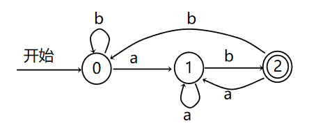
        <p align="center">
          <span>识别(a|b)*ab的DFA<span>
        </p>
</p>

> 例3：画出DFA，识别{0,1}上能被3整除的二进制数并写出正规式

<p align="center">
	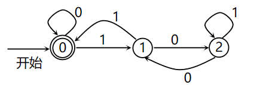
        <p align="center">
          <span>能被3整除的二进制数DFA<span>
        </p>
</p>

> 一般都是由正规定义画出对应DFA图，或者由DFA图写出正规定义，本题中DFA图更好写出来，所以先写DFA图，再写出正规式。
>
> 作DFA图(为上面的DFA图)
>
> 考虑二进制数在后面加1的意义是将原来的数变为原来的两倍加1，比如二进制数101转换为十进制为5，而二进制数1011为十进制的11，同理二进制数在后面加0的意义是将原来的数变为原来的两倍。所以现在考虑什么样的二进制数才能被3整除，首先考虑3余数的三种情况，分别为0,1,2，由于为0时，就可以直接返回或者在后面加0，仍然是满足的，也可以在后面加1处理，余数变为1;为1时，在后面加1，就会变为原来的2倍加1，根据数论的知识，可以知道此时余数为2×1+1=3即为0，或者加0处理，则余数为2;而为2时，就可以进行加0处理，同理此时为余数为1，可以按照余数为1进行处理，或者进行加1除了，此时余数变为2，就会重复进行。(之所以要考虑就算在后面加0或者加1也不能把余数变为0的情况，是因为这个DFA是一个筛选过程，所以要考虑每种可能的二进制数)
>
> 此时已经有上述思路了，所以以余数0,1,2为分为0,1,2状态，显然0需要作为 `开始状态` (二进制是以0开始的)，同时也要为 `接收状态` (要返回余数为0的二进制数)，从0状态可以加0变为 `0状态` ，或者加1变为 `1状态` ，同理按照上面的要求，从 `1状态` 加1变为 `0状态` ，加0变为 `2状态` ，而 `2状态` 加1变为 `2状态` ，加1变为 `1状态`。此时DFA图就可以画出。
> 
> 写出正规式
>
> 一般从DFA图推导正规定义，有一种方法，需要倒推，就是从最后一个节点(状态)，从后往前推，比较适合 `接收状态` 和 `开始状态` 为一个状态的时候， ***因为这种结构一般说明其正规定义整体上是个闭包形式，因为从别的状态最终要返回接受状态一定会形成一个闭环。***
>
> 本题目先从2这个状态开始逆推，由于可以看出来从 `1状态` 转到 `2状态` 只能是传递0，说明该该部分正规定义是以0开始，而 `2状态` 传递1时返回自身状态，即自我形成闭包即 $1^{\*}$ 由于最终要返回到 `接收状态 `而 `2状态` 不能直接返回，所以不难看出来要先传递0返回到 `1状态` ，所以必须该正规定义要用0为结尾，最终可以得到正规定义 $01^{\*}1$ ,同时不难看出来 `1状态` 和 `2状态` 直接形成了一个闭环，所以说明这部分形成一个闭包，正规定义写为 $(01^{\*}0)^{\*}$ 。此时 `2状态` 部分正规定义已经写出
>
> 再来推导 `1状态` ，同上面，发现从 `接收状态` 转到 `1状态` 的时候只能传递1，说明该部分正规定义以1开始，由于前面从 `1状态` 转到 `2状态` 时的正规定义 $(01^{\*}0)^{\*}$ 同时从 `1状态` 转到 `接收状态` 必须输入1，所以正规定义以1结尾，此时，正规定义为 $1(01^{\*}0)^{\*}1$ ,同上， `接受状态` 和 `1状态` 之间形成了一个闭环，所以为一个闭包，但此时先不写成闭包形式。( ***上面直接写成闭包形式，是因为 `状态1` 自身没有形成闭包，而 `接收状态` 自身形成闭包，所以先不写***)
>
> 最后可发现从 `开始状态(接收状态)` 回到自身(结束判断)有两种选择，一个是传输0，另一个为从 `1状态` 返回，所以该两种选择构成选择关系，同时不难发现，两种选择都形成闭包，为了简洁，所以把闭包写为一个整体的形式，最后得到正规定义 $(0|1(01^{\*}0)^{\*}1)^{\*}$ 。
>
> 可视化过程如下：

<p align="center">
	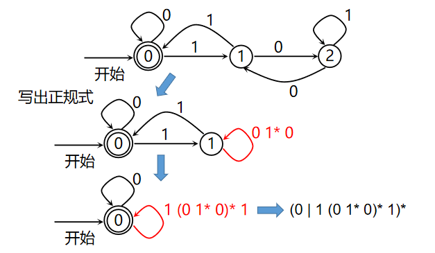
        <p align="center">
          <span>能被3整除的二进制数正规定义<span>
        </p>
</p>

> 例4:画出DFA，识别{0,1}上能被5整除的二进制数并写出正规式

<p align="center">
	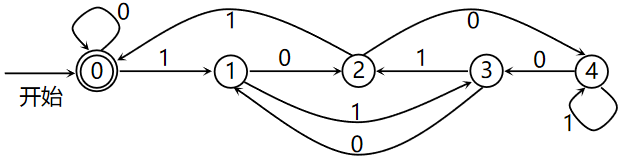
        <p align="center">
          <span>能被5整除的二进制数DFA<span>
        </p>
</p>


<p> </p>
<p> </p>
<p> </p>
<div id="footnote" style="font-size:10px">
	<h6 id="footnote1">
		[1]:标识符（Identifier）是指用来表示程序中变量、函数、类、对象或其他命名实体的名称或符号。标识符通常由字母、数字和下划线组成，并且必须遵循特定的命名规则和约定，以确保程序的正确性和可读性。不同的编程语言可能对标识符的命名规则有不同的要求，但通常包括以下一般规则：
		<h6>1.标识符必须以字母（包括大写和小写字母）或下划线(_)开头。</h6>
		<h6>2.标识符可以包含字母、数字和下划线。</h6>
		<h6>3.标识符通常区分大小写，意味着大写字母和小写字母被认为是不同的标识符。</h6>
		<h6>4.标识符不能是编程语言的关键字或保留字，这些关键字具有特殊含义，用于编程语言的语法和语义。<a href="#/?id=back1">➹返回</a></h6>
	</h6>
	<h6 id="footnote2">
		[2]:正则表达式是由一系列字符和元字符组成的模式，用于定义字符串的搜索模式。正则表达式可以用于文本搜索、替换、验证和提取等各种文本处理任务。以下是一些常见的正则表达式元字符和用法(python可用)：
		<h6>.：匹配任意单个字符，除了换行符。</h6>
		<h6>*：匹配前面的字符零次或多次。</h6>
		<h6>+：匹配前面的字符一次或多次。</h6>
		<h6>?：匹配前面的字符零次或一次。</h6>
		<h6>[]：定义字符集，匹配其中的任何一个字符。例如，[aeiou] 匹配任何一个元音字母。</h6>
		<h6>[^]：定义反向字符集，匹配除了括号内字符之外的任何字符。例如，[^0-9] 匹配任何非数字字符。</h6>
		<h6>()：定义分组，可以用于捕获匹配的子字符串或应用操作符。</h6>
		<h6>|：表示逻辑或，用于匹配多个模式中的一个。</h6>
		<h6>^：匹配字符串的开头。</h6>
		<h6>$：匹配字符串的结尾。</h6>
		<h6>\d：匹配数字字符，等同于 [0-9]。</h6>
		<h6>\w：匹配单词字符，包括字母、数字和下划线，等同于 [a-zA-Z0-9_]。</h6>
		<h6>\s：匹配空白字符，包括空格、制表符和换行符。</h6>
		<h6>\b：匹配单词边界。<a href="#/?id=back2">➹返回</a></h6>
	</h6>
	<h6 id="footnote3">
		[3]:前缀是指读入输入串中某个符合规则的语法单元后紧跟的语法单元，比如输入串为一个注解/\*abcd\*/，读入注解/*后a即为前缀，\*也可以看成是前缀(或它本身)，再比如输入串为“ $\ \ sdldk$ ”读入一个空格后，后面还有一个空格，后面的空格即为前缀。<a href="#/?id=back3">➹返回</a>
	</h6>
</div>
