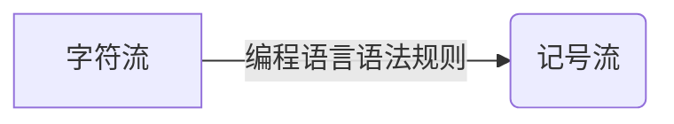
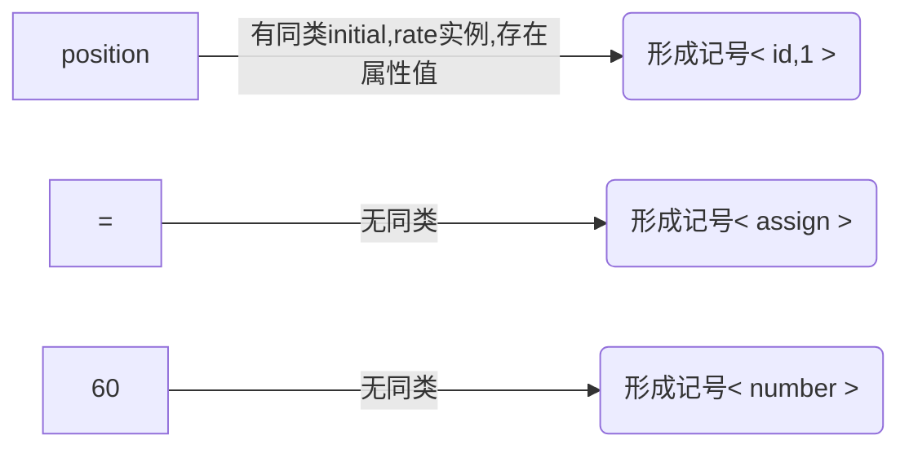
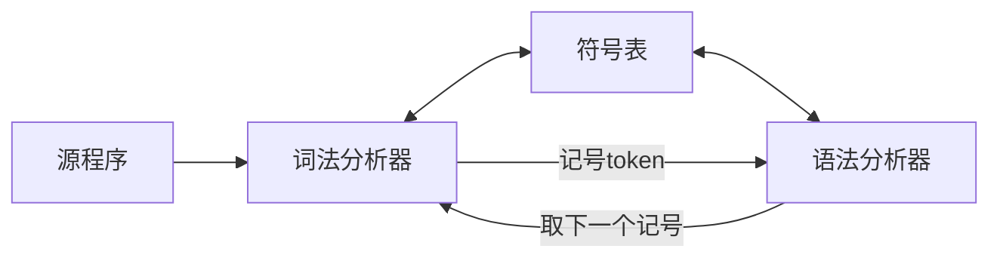

# 课前须知
> 评分与密码学大同小异，作业和点名不计入总分，但是作为调分的依据，作业分计入标准（是否准时，是否抄袭）。
> 
> 课程难度:前难后稍难，不建议自学和考前突击。
> 
> 期末闭卷，主要为概念理解和掌握方法。
> 
> 学期总评:期末80，实验20

# 第一章:引论
## 1.1 编译器概述
> 以下为编译的各个阶段
### 1.1.1 词法分析
<a href="#/?id=second">详见第二章</a>

> 又称线性分析或扫描
> 
> 字符流是指源程序的编程语句，类似 `position=initial+rate*60`

> 注:记号流格式:`<记号名，属性名>`，记号名是同类词法单元共用名称，属性值为区分其他同类词法单元实例的特征值，若某类词法单元只有一个实例，则属性值可省略。例如

最终字符流转化为记号流 `<id，1><=><id，2><+><id，3><*><60>`（为直观某些部分改写）

### 1.1.2 语法分析
### 1.1.3 语义分析
### 1.1.4 中间代码生成
### 1.1.5 代码优化
### 1.1.6 代码生成
### 1.1.7 符号表管理
### 1.1.8 阶段的分组
### 1.1.9 解释器
## 1.2 编译器技术的应用（只做了解，不做考察）

# 第二章 词法分析
<span id="second"></span>



- 词法分析器：把构成源程序的字符流翻译成记号流，还完成和用户接口的一些任务
  > 如： `position = initial + rate * 60 → <id，1><=><id，2><+><id，3><*><60>`
  > 1. 剥去源程序的注解和（由空格、制表或换行符等引起的）空白；
  > 2. 把来自编译器各个阶段的错误信息和源程序联系起来；
  > 3. 如果源语言支持宏定义，那么对它们的预处理也可以在词法分析器完成。
- 记号：具有独立含义的最小词法单位
- 围绕词法分析器的自动生成展开
- 介绍正规式、状态转换图和有限自动机概念

## 2.1 词法记号与属性
### 2.1.1 词法记号、模式、词法单元
#### 定义
- 词法记号（简称记号）：是由记号名和属性值构成的二元组，*属性值不是必须项*。记号名为语法分析的输入符号。
  > *记号名是代表一类词法单元的抽象名字，比如标识符 <sup id="back1"><a href="#/?id=footnote1">1✍</a></sup> relation（关系，如<,>...，统称为relation）和某个特定的关键字如if（就是代表if判断）*
  > 
  > **粗俗理解就是关键词是某个编程语言中的语法词或者内置函数名，标识符为符合某种规则的变量或者函数名称**

- 模式：一个记号的模式描述属于该记号的词法单元形式。 ***在一个关键字作为一个记号的情况下，它的模式就是构成该关键字的字符序列。如if为模式为i,f***
  > 对于标识符和其他一些记号，他们的模式有更复杂的结构并且有很多字符串可以 **匹配** 它们，比如relation中的模式有<,>...。
  > ***为便于理解，不妨认为模式就是一个匹配规则，也就是当某个实例匹配到一个匹配规则时，也就是匹配到了一个记号名的模式***
  > > ***举个例子（C语言中）：printf("Total=%d\n",score);该语句中printf和score是匹配到id模式（可见下表即由字母开头的字母数字串）的词法单元，而"Total=%d\n"是匹配到litera模式(引号 " 和 " 之间任意不含引号本身的字符串)的词法单元***
- 词法单元（又称单词）：是源程序中匹配一个记号模式的字符序列，由词法分析器识别为该记号的一个实例。

<div align="center">
  <h6><strong>记号的例子</strong></h6>
  <table>
  <thead>
    <tr>
      <th>记号名</th>
      <th>词法单元例举</th>
      <th>模式的非形式描述</th>
    </tr>
  </thead>
  <tbody>
    <tr>
      <td>if</td>
      <td>if</td>
      <td>字符i, f</td>
    </tr>
    <tr>
      <td>for</td>
      <td>for</td>
      <td>字符f, o, r</td>
    </tr>
    <tr>
      <td>relation</td>
      <td>&lt;, &le;, =, …</td>
      <td>&lt; 或 &le; 或 = 或 …</td>
    </tr>
    <tr>
      <td>id</td>
      <td>sum, count, D5</td>
      <td>由字母开头的字母数字串</td>
    </tr>
    <tr>
      <td>number</td>
      <td>3.1, 10, 2.8E12</td>
      <td>任何数值常数</td>
    </tr>
    <tr>
      <td>literal</td>
      <td>"seg. error"</td>
      <td>引号 " 和 " 之间任意不含引号本身的字符串</td>
    </tr>
  </tbody>
</table>
</div>

#### 历史上词法定义中的一些问题
- 忽略空格（空格无意义，除非在字符串中，不作为语法单元的分隔符）带来的困难
	> DO 8 I = 3. 75 等同于 DO8I=3. 75 ，只有看到小数点，才知道DO不是关键字，而DO8I为一个关键字.
 
	> DO 8 I = 3, 75有7个记号，只有看到逗号才知道DO是关键字，8为语句标号，I为标识符。
- 关键字不保留
	> IF THEN THEN THEN=ELSE；ELSE …

- 关键字、保留字和标准标识符的区别
  > 保留字是语言预先确定了含义的词法单元。
  > > ***便于理解，相当于没有功能的关键词，还是不能当普通标识符使用。***
  
  > 标准标识符也是预先确定了含义的标识符，但程序可以重新声明它的含义。

### 2.1.2 词法记号的属性
> 为了区分同一个记号中的不同单词，比如记号relation中的单词<,>...所以需要给记号以属性，用属性来记住记号的附加信息，以便需要时使用。
> ***通俗来讲，记号名影响语法分析的决策，属性影响记号的翻译***

- 例如：position = initial + rate * 60的记号和属性值：
	- [x] <id，指向符号表中position条目的指针>
	- [x] < assign_op >(此处没有属性值，是因为记号名已经足以判断词法单元)
	- [x] <id，指向符号表中initial条目的指针>
	- [x] < add_op >
	- [x] <id，指向符号表中rate条目的指针>
	- [x] < mul_op >
	- [x] <number，整数值60>

### 2.1.3 词法错误
#### 定义
- 词法分析器对源程序采取非常局部的观点
  > - [x] 例：难以发现下面的错误
  > > fi (a == f (x) ) 
- 在实数是“数字串.数字串”格式下，可以发现下面的错误
	> 123.x
- 紧急方式的错误恢复
	> 删掉当前若干个字符，直至能读出正确的记号
- 错误修补（基于这样的假设，大多数词法错误是多、漏或错了一个字符或者相邻的两个字符错位。但是这种假设通常是（但不总是）正确的）
	> 进行增、删、替换和交换字符的尝试

#### 示例
```
下面C语言编译器编译下面的函数时，报告
	parse error before 'else'
long gcd(p,q)
long p,q;
{
	if (p%q == 0)
		/* then part */
		return q		此处遗漏分号
	else
		/* else part */
		return gcd(q, p%q);
```
此时会尝试删除一部分，比如删去当前位置前方的 `*/` ，
```
现在少了第一个注释的结束符号后，反而不报错了
long gcd(p,q)
long p,q;
{
	if (p%q == 0)
		/* then part 
		return q
	else
		/* else part */
		return gcd(q, p%q);
}
```
这个说明自我改错，不一定是正确的。

## 2.2 词法记号的描述与识别
### 2.2.1 串和语言
#### 定义
- **字母表** : ***表示符号的有限集合*** ，符号的典型例子由英文字母和标点符号。集合{0,1}是二进制字母表；ASCII是字母表的重要例子，；Unicode是另一个重要例子，包含了全世界各个字母表的大约十万个字符。
- **串** ： ***字母表符号的有穷序列为该字母表上的串*** 。 *串s的长度是出现在s中符号的个数，往往写为|s|* 。
	> **空串是长度为0的特殊串，用 $\epsilon$ 表示**
- **语言** ： ***表示字母表上的一个串集*** 。
- **句子** ： ***属于某个语言的串成为该语言的句子或者字*** 。
	> **空集 $\varnothing$ 和{ $\epsilon$ }(仅含空串 $\epsilon$ )也符合上述的定义**

#### 串的运算
- **连接** : **x,y都为串，则x和y的连接写为xy，即把y加到x后面形成的串** 。
	> **对于连接运算，空串是个恒等元素，即 $s\epsilon =\epsilon s =s$**
- **幂** : **s为串，定义 $s^0$ 为 $\epsilon$ , $s^i$ 为 $s^{i-1}s(i>0)$** 。
	> **由于 $\epsilon s =s$ 所以 $s^2=ss,s^3=sss$ ，即幂就是n次连接的意思。** 
-  **选择** : **x,y都为串，则x和y的选择写为x|y，即在x和y中进行选择x或y形成的串(串的选择运算非常不常用，在正规式里面理解为并集运算，在正规定义中理解为多选一的选择就可以)** 。

#### 语言的运算
- **幂** : **L为语言，定义 $L^0$ 为{ $\epsilon$ }, $L^i$ 为 $L^{i-1}L(i>0)$ ,即 $L^i$ 是L连接它自己i-1次** 。
- **并** : **L，M为语言，定义 $L \cup M=\lbrace s|s属L或s属M\rbrace$ ，L和M的并写为 $L \cup M$** 。
- **连接** : **L，M为语言，定义 $LM=\lbrace st|s属L且t属M\rbrace$ ，L和M的连接写为 $LM$** 。
- **闭包** : **L为语言，定义 $L^*= \bigcup\limits_{i=0}^\infty L^i,L^{\*}表示0个或者多个L连接的并集$ ，L的闭包写为 $L^{\*}$** 。
- **正闭包** : **L为语言，定义 $L^+= \bigcup\limits_{i=1}^\infty L^i,L^{+}表示1个或者多个L连接的并集$ ，L的闭包写为 $L^{+}$** 。
> - [x] 示例：L:{ A, B, …, Z, a, b, …, z }, D: { 0, 1, …, 9 }
> - [x] $L \cup M$ 字母和数字的集合。
> - [x] $LD$ 所有由一个字母后跟随一个数字组成的串的集合。
> - [x] $L^6$ 所有由6个字母组成的串的集合。
> - [x] $L^*$ 所有字母串(包括 $\epsilon$ )的集合。
> - [x] $L(L \cup M)^*$ 以字母开头的所有字母数字串的集合。
> - [x] $D^+$ 不含空串的数字串的集合。

### 2.2.2 正规式
#### 定义
- ***正规式(又称正规表达式，正则表达式 <sup id="back2"><a href="#/?id=footnote2">2✍</a></sup>)*** : **按照一组定义规则，由较简单的正规式构成的，每个正规式r表示一个语言L(r)**
	> 通俗理解，正规式就是一套规则定义，里面的实例为满足该规则的词法单元。
- **以下是字母表 $\sum$ 上正规式的规则，和每条规则相联系的是被定义的正规式所表示的语言的描述：**
	> 1. $\epsilon$ 是正规式，它表示{ $\epsilon$ }
	> 2. 如果a是 $\sum$ 上的符号，那么a可以作为正规式，他表示语言{a}。虽然都用a表示，但是正规式a是不同于{a}中的句子a的，从上下文可以清楚地区别所谈到的a是正规式还是串。
	> 3. 假定r和s都是正规式，它们分别表示语言L(r)和L(s)，那么(r)|(s)、(r)(s)、 $(r)^{\*}$ 和(r)都是正规式，分别表示语言 $L(r) \cup L(s)$ 、 $L(r)L(s)$ 、 $(L(r))^*$ 和 $L(r)$ 。
- ***正规式表示的语言叫做正规语言或者正规集***
  > - [ ] 如果有约定:
  > - [x] 1.闭包运算(算符为*)有最高的优先级并且是左结合的运算；
  > - [x] 2.连接运算(两个正规式并列)的优先级次之且也是左结合的运算；
  > - [x] 3.选择运算(算符是|)的优先级最低且仍然是左结合的运算。
  > - [x] 那么可以避免正规式中一些不必要的括号。例如， $((a)(b)^{\*})|(c)$ 等价于 $ab^{\*}|c$

| 正规式                    | 定义的语言              | 备注                           |
| ------------------------- | ----------------------- | ------------------------------ |
| $\epsilon$                | { $\epsilon$ }          |                                |
| $a$                       | { $a$ }                 | $a \in\sum$                    |
| $(r) \| (s)$              | $L(r) \cup L(s)$        | r和s是正规式                    |
| $(r)(s)$                  | $L(r)L(s)$              | r和s是正规式                    |
| $(r)^{\*}$                | $(L(r))^{\*}$           | r是正规式                       |
| $(r)$                     | $L(r)$                  | r是正规式                       |
| $((a)(b))^{\*}\|(c)$      |可以写成 $ab^{\*}\|c$    |                                 |  

#### 示例
> 正规式的例子 $\sum = \lbrace a, b\rbrace$
> > $a|b$ 代表集合 $\lbrace a, b\rbrace$ (语言也是一种集串所以也可以说这个集合代表了一种语言，下同)
> > 
> > $(a|b)(a|b)$ 代表集合 $\lbrace aa, ab, ba, bb\rbrace$
> > 
> > $aa|ab|ba|bb$ 代表集合 $\lbrace aa, ab, ba, bb\rbrace$
> > 
> > $a^*$ 表示由字母a构成的所有串集，包括空串
> > 
> > $(a|b)^{\*}$ 由a和b构成的所有串集，包括空串

> 复杂的例子
> > $(00|11|((01|10)(00|11)^{\*}(01|10)))^{\*}$
> > 
> > 句子：01001101000010000010111001
> > 
> > 描述：0和1的个数都是偶数的01串

#### 正规式的代数定理

| 定律                    | 描述              | 
| :----------------------: | :-----------------------: |
| $r\|s=s\|r$               | $\|$ 是可交换的         |
| $r\|(s\|t)=(r\|s)\|t$     | $\|$ 是可交换的         |
| $(rs)t=r(st)$             | 连接是可结合的           |
| $r(s\|t)=rs\|rt;(s\|t)r=sr\|tr$  | 连接对 $\|$ 是可分配的    |
| $\epsilon r=r;r\epsilon =r$  | $\epsilon$ 是连接的恒等元素    |
| $r^{\*}=(r\|\epsilon)^{\*}$  | $\epsilon$ 肯定出现在一个闭包中|
| $r^{**}=r^{*}$      | *是幂等的    |

### 2.2.3 正规定义
#### 定义
- ***正规定义*** : ***为了在引用相应正规式时在表示时更加简洁，对正规式进行命名*** 。
- 例：如果 $\sum$ 是基本符号的字母表，那么 **正规定义** 是形式为 $d_1 → r_1  \ d_2 → r_2...d_n → r_n$ 的定义序列。
  > 各个 $d_i$ 的名字都不同；
  >
  > 每个 $r_i$ 都是 $\sum \cup \lbrace d_1,d_2,...,d_n\rbrace$上的正规式
  >
  > - [x] 满足上述两个条件后，每个 $r_i$ 都只能含有 $\sum$ 上的符号和前面定义的名字，因此不会出现递归定义的情况。这些名字用其所表示的正规式来代替，就可以为任何 $r_i$ 构造 $\sum$ 上的正规式。

#### 示例
- C语言的 **标识符** 是字母、数字和下划线组成的串 
	> $letter\underline{}→ A | B | … | Z | a | b | … | z |\underline{}$
 	> 
	> $digit→ 0 | 1 | … | 9$
 	> 
	> $id→letter\underline{}(letter\underline{}|digit)^*$

- 无符号数集合，例1946, 11.28, 63E8, 1.99E-6
	> $digit → 0| 1 | … | 9$ (0~9数字集合)
	> 
	> $digits → digit \ digit^*$ (整数集合,可以简写为 $digit^{\*}$ )
	>
 	> $optional\underline{}fraction → .digits|ε$ (可选的分数部分,即(.后连接一个数字)或者为空串，所以说是可选的，这里就体现了选择优先级小于连接)
	> 
	> $optional\underline{}exponent → ( E ( + | - | ε ) digits ) | ε$ (可选的指数部分,即(E后连接一个±或者空串在连接一个数字)或者空串，所以是可选的)
	>
	> $number \rightarrow digits \ optional\underline{}fraction \ optional\underline{}exponent$
 	> > 简化表示: $number → digit^+ (.digit^+)? (E(+|-)? digit^+)?$ (?在这里可以代表可以为?前的正规式或者为空串)
	
- 正规定义的例子（进行下一步<sup id="ExampleBack"><a href="#/?id=next1">➷</a></sup>讨论的例子）
	- [x] $while → while$
	- [x] $do → do$
	- [x] $relop → < | < = | = | < > | > | > =$
	- [x] $letter → A | B | … | Z | a | b | … | z$
	- [x] $id → letter (letter | digit )^*$
	- [x] $number → digit^+(.digit^+)? (E (+|-)? digit^+)?$
	- [x] $delim → blank | tab | newline$ (非终结符号，表示分隔符,后面分别代表空格、制表符和换行符)
	- [x] $ws → delim^+$ (通常表示空白字符（whitespace）)

#### 关于部分简写
- [x] ***?***:**零个或者一个实例。 $r?=r|\epsilon$ , $(r)?=L(r) \cup \lbrace \epsilon \rbrace$**
- [x] ***字符组***:**[abc](a、b和c是字母表的符号)表示正规式 $a|b|c$。缩写字符组[a-z]表示正规式 $a|b|...|z$ 。例如 $letter\underline{} → [A-Za-z]$ 。**

#### 例题(非常重要且很难，主要得掌握思想)
- 问题：写出语言“所有相邻数字都不相同的非空数字串”的正规定义
  > - [x] $no_{0-8} → 9$ (不含0-8并且满足相邻数字都不相同的非空数字串)
  > - [x] $no_{0-7}→ (8|no_{0-8} \ 8)(no_{0-8} \ 8)^*(no_{0-8}| \ espilon)|no_{0-8}$ (不含0-7并且满足相邻数字都不相同的非空数字串)
  > - [x] **来分析以下上面的定义结构,总体上看是两个大的选择，一个是9，一个是 $no_{0-7}→ (8|no_{0-8} \ 8)(no_{0-8} \ 8)^{\*}(no_{0-8}| \ espilon)$ ，而这一串可以看出来要么开头是8，要么是98(可以不为9是因为之前有一个单独为9的选择)，然后中间就是接多个98串或者不接，最后结尾就相当于是在选择以9结尾还是不选择(即以8结尾)。** 
  > - [x] ...(重复上面定义就可以)
  > - [x] $no_{0} → (1|no_{0-1} \ 1) (no_{0-1} \ 1 )^*(no_{0-1}| \epsilon) | no_{0-1}$ (不含0并且满足相邻数字都不相同的非空数字串)
  > - [x] $answer → (0|\epsilon ) (no_{0} \ 0 )^* (no_{0} | \epsilon )|no_{0}$ 包含空串，不符合定义
  > - [x] $answer → (0 |no_{0} \ 0 ) (no{0} \ 0 )^* (no_{0}  | \epsilon)|no_{0}$
  > - [x] ***总结，发现此类问题类似一个递归的过程，可以从简入繁。而且需要会用已知的某些正规式去推其他的正规定义，比如上面的代表偶数个1和0的0，1串定义为even10，则偶数个0奇数个1可以定义为even10 1 even10***

#### 二义性及其消除
- ***如何理解do8？***
  > - [ ] 关键词do和整数8? 
  > - [ ] 标识符（id）do8?
- ***解决方法：***
  > - [x] ***最长匹配：取可与任何(任意)正规表达式匹配的最长的字符串作为一个记号***
  > - [x] ***规则优先：对于特定的初始子串，第一个与之匹配的正则表达式决定了这个子串的记号类型。此时正规定义的顺序是有意义的***
  > - [x] ***最长匹配下，do8被解释为一个标识符；规则优先下，do是一个关键字***

### 2.2.4 状态转换图
#### 定义
- 在上述的正规定义的例子<sup id="next1"><a href="#/?id=ExampleBack">➹</a></sup>中，可以看到，在词法单元中还有间隔符ws，词法分析器通过把剩余输入的前缀(即一个语法单元前面多余的部分)和ws相比较来完成忽略的词法单元之间的空白。
- 如果剩余输入的前缀可以由ws匹配，词法分析器不返回记号给分析器，继续寻找空白后面的记号，然后再返回到分析。一般的正规式是有对应记号的。但是正规式ws没有对应的记号，可见下表。

<div align="center">
	<table>
  <tr>
    <th>正规式</th>
    <th>记号名</th>
    <th>属性值</th>
  </tr>
  <tr>
    <td><strong>ws</strong></td>
    <td>-</td>
    <td>-</td>
  </tr>
  <tr>
    <td>while</td>
    <td><strong>while</strong></td>
    <td>-</td>
  </tr>
  <tr>
    <td>do</td>
    <td><strong>do</strong></td>
    <td>-</td>
  </tr>
  <tr>
    <td><strong>id</strong></td>
    <td><strong>id</strong></td>
    <td>符号表条目的指针</td>
  </tr>
  <tr>
    <td><strong>number</strong></td>
    <td><strong>number</strong></td>
    <td>数表条目的指针</td>
  </tr>
  <tr>
    <td>while</td>
    <td><strong>while</strong></td>
    <td>LT(<)、LE(≤)、EQ(=)、NE(≠)、GT(>)或GE(≥)</td>
  </tr>
</table>
</div>

- *绘制 **状态转换图(简称转换图)** 是构造词法分析器的第一步* 。***状态转换图描绘词法分析器被语法分析器调用时，词法分析器未返回下一个记号所做的动作*** 。

#### 示例
- ***关系算符的转换图***

<p align="center">
	
        <p align="center">
          <span>关系算符的转换图<span>
        </p>
</p>
		
- [x] 解释：转换图上的圆圈表示 **状态**，状态由有向 **边** 连接，边上有指示输入字符的标记，标记通常是一个字符。若离开形状s的某个边上(类似上图6到8处有个other)，则表示离开s的其他边所指示的字符以外的任意字符(以6到8的为例，6→8边上有一个other表示除6→7上的=的字符以外的任意字符)。
- [x] 本节讨论的转换图是确定的，即不可能出现某一字符和离开一个状态的两条边上的标记都匹配的情况。
- [x] 在转换图中有一个状态标记为开始状态，为转换图的初始状态。当开始识别记号时，控制进入开始状态。当控制进入某个状态时，读输入串的下一个字符，如果离开这个状态的一条边上的标记和该输入字符匹配，控制就进入由这条边指向的状态，否则识别过程失败。某些状态为圆环，表示为 **接收状态** ，控制进入这样的状态表明识别了一个记号。接收状态可以有动作，控制到达接收状态时执行它的动作。

<p align="center">
	
        <p align="center">
          <span>标识符和关键字的转换图<span>
        </p>
</p>
<p align="center">
	
        <p align="center">
          <span>无符号数的转换图<span>
        </p>
</p>
<p align="center">
	
        <p align="center">
          <span>空白的转换图<span>
        </p>
</p>
<p align="center">
	
        <p align="center">
          <span>if + switch实现<span>
        </p>
</p>
		  
#### 


<p> </p>
<p> </p>
<p> </p>
<div id="footnote" style="font-size:10px">
	<h6 id="footnote1">
		[1]:标识符（Identifier）是指用来表示程序中变量、函数、类、对象或其他命名实体的名称或符号。标识符通常由字母、数字和下划线组成，并且必须遵循特定的命名规则和约定，以确保程序的正确性和可读性。不同的编程语言可能对标识符的命名规则有不同的要求，但通常包括以下一般规则：
		<h6>1.标识符必须以字母（包括大写和小写字母）或下划线(_)开头。</h6>
		<h6>2.标识符可以包含字母、数字和下划线。</h6>
		<h6>3.标识符通常区分大小写，意味着大写字母和小写字母被认为是不同的标识符。</h6>
		<h6>4.标识符不能是编程语言的关键字或保留字，这些关键字具有特殊含义，用于编程语言的语法和语义。<a href="#/?id=back1">➹返回</a></h6>
	</h6>
	<h6 id="footnote2">
		[2]:正则表达式是由一系列字符和元字符组成的模式，用于定义字符串的搜索模式。正则表达式可以用于文本搜索、替换、验证和提取等各种文本处理任务。以下是一些常见的正则表达式元字符和用法(python可用)：
		<h6>.：匹配任意单个字符，除了换行符。</h6>
		<h6>*：匹配前面的字符零次或多次。</h6>
		<h6>+：匹配前面的字符一次或多次。</h6>
		<h6>?：匹配前面的字符零次或一次。</h6>
		<h6>[]：定义字符集，匹配其中的任何一个字符。例如，[aeiou] 匹配任何一个元音字母。</h6>
		<h6>[^]：定义反向字符集，匹配除了括号内字符之外的任何字符。例如，[^0-9] 匹配任何非数字字符。</h6>
		<h6>()：定义分组，可以用于捕获匹配的子字符串或应用操作符。</h6>
		<h6>|：表示逻辑或，用于匹配多个模式中的一个。</h6>
		<h6>^：匹配字符串的开头。</h6>
		<h6>$：匹配字符串的结尾。</h6>
		<h6>\d：匹配数字字符，等同于 [0-9]。</h6>
		<h6>\w：匹配单词字符，包括字母、数字和下划线，等同于 [a-zA-Z0-9_]。</h6>
		<h6>\s：匹配空白字符，包括空格、制表符和换行符。</h6>
		<h6>\b：匹配单词边界。<a href="#/?id=back2">➹返回</a></h6>
	</h6>
</div>
